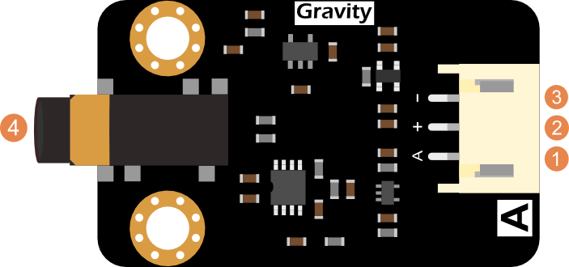
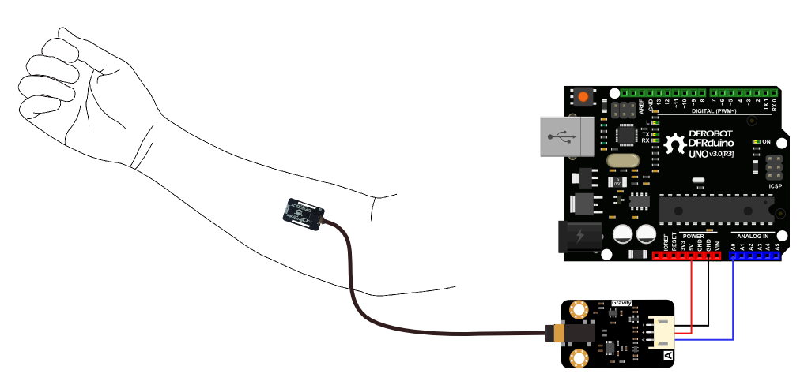
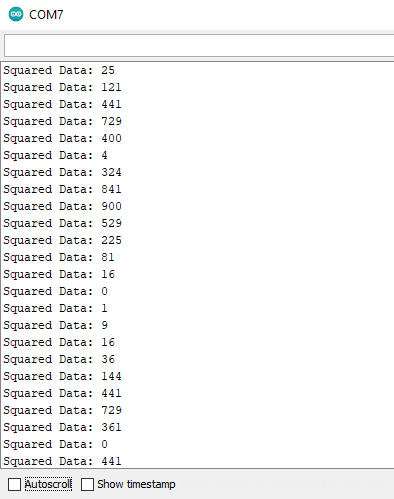

# SEN0240_Demo
This repository contains code and documentation on how to collect data from an SEN0240 Electromyography sensor.
With this repoitory you should be able to visualise simple muscle contravtion.

## Hardware needed

A [SEN0240](https://www.dfrobot.com/product-1661.html) is needed to get muscle contraction info.
An [Arduino](https://store.arduino.cc/) (or similar) to compute data from SEN0240.

## prerequisite

If you are using a clone of arduino please download firmware to detect device in Arduino firmware.

It should now appear fine in [Arduino IDE](https://www.arduino.cc/en/Main/OldSoftwareReleases) under tools => port.

## Connection

The SEN0240 control board should look like this.



| Port    | Description       | Connected to          |
| --------|-------------------|-----------------------|
| 1       | Data port         | Arduino A0 pin        |
| 2       | Anode             | Arduino 3V or 5V power|
| 3       | Cathode           | Arduino GND           |
| 4       | Sensor Connector  | Sensor port           |

The connection to the Arduino should now look something like this.



## Sensor position

You can place the EMG sensor on any large enough muscle. The sensor's surface and the skin should be dry.
The 3 electrodes of the sensor should be place in alignement of the muscle and be pressed against the skin.

## Code execution

### Run the code on the board
1. Open SEN0240_Demo/SEN0240_Demo.ino in Arduino.
2. Install the [EMGFilters Library](https://codeload.github.com/yuyouliang/EMG_Filter/zip/master).
3. Select your board under Tools > Board.
4. Select the port to witch the board is connected under **Tools > Port**.
5. Click the verify icon to check for errors.
6. Upload the code to your board. The code is running as soon as it is uploded.

### Sensor calibration
1. Open the serial monitor under **Tools > Serial Monitor** and completly relax your muscle.
2. You should see something similar to this:



If your values are higher than 1500 you should try to disharge yourself of any static electricity and/or find another sensor placement more in contact with skin and muscle.

3. Change this variable to the highest value recorded in the serial monitor.
```C
static int Threshold = 0;
```
The sensor is now calibrated. You can now upload the code to the bord agin and test the sensor by contracting your muscle while looking to the serial plotter under **Tools > Serial Plotter**.

## Some advices

TBD
